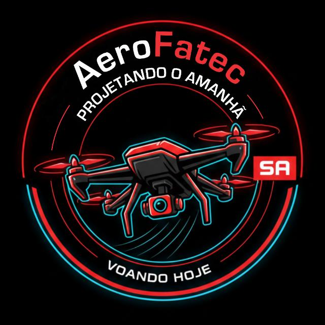

# 🛸 AeroFatec - Site Institucional & de Apoio



Este repositório contém o código-fonte do site oficial da **AeroFatec**, uma equipe de engenharia focada no desenvolvimento de drones de alta performance para a competição **EletroQuad SAE BRASIL 2027**.

O projeto foi construído com foco em uma experiência de usuário (UX) imersiva, utilizando padrões estéticos modernos e uma arquitetura de código limpa.

## 🚀 Tecnologias Utilizadas

O projeto prioriza performance e controle total sobre o design (estratégia Vanilla):

* **HTML5 Semântico:** Estrutura clara e otimizada para SEO.
* **CSS3 Moderno:** * **Layout:** Uso de Flexbox e CSS Grid (Bento Grid Style).
    * **Identidade:** Paleta "Aero Racing" (Vermelho #D32F2F e Dark Mode).
    * **Tipografia:** Montserrat (Display) e DM Sans (Body).
* **Vanilla JavaScript:** * Gerenciamento de Modais dinâmicos para a seção de equipe.
    * Animações de entrada de página (*Page Fade-in*).

## 🎨 Diferenciais do Projeto

### 1. Apple-Inspired UI (Racing Edition)
O layout utiliza o conceito de **Bento Grid** para apresentar as especificações técnicas, adaptado com uma estética agressiva de competição.

### 2. Componentização de Membros
Sistema de modais que carrega dados via atributos `data-*`, facilitando a manutenção e adição de novos integrantes à equipe.

### 3. Página de Apoio (Crowdfunding)
Página dedicada (`apoie.html`) com integração visual para doações via PIX e plataforma Vakinha.

## 🛠️ Como Executar o Projeto

1.  Clone o repositório:
    ```bash
    git clone [https://github.com/seu-usuario/AeroFatec.git](https://github.com/seu-usuario/AeroFatec.git)
    ```
2.  Abra o arquivo `index.html` em seu navegador.

---

**Desenvolvedor Principal:** Brayan Nunes  
**Equipe:** AeroFatec - FATEC Santo André  
**Competição:** EletroQuad SAE BRASIL 2027